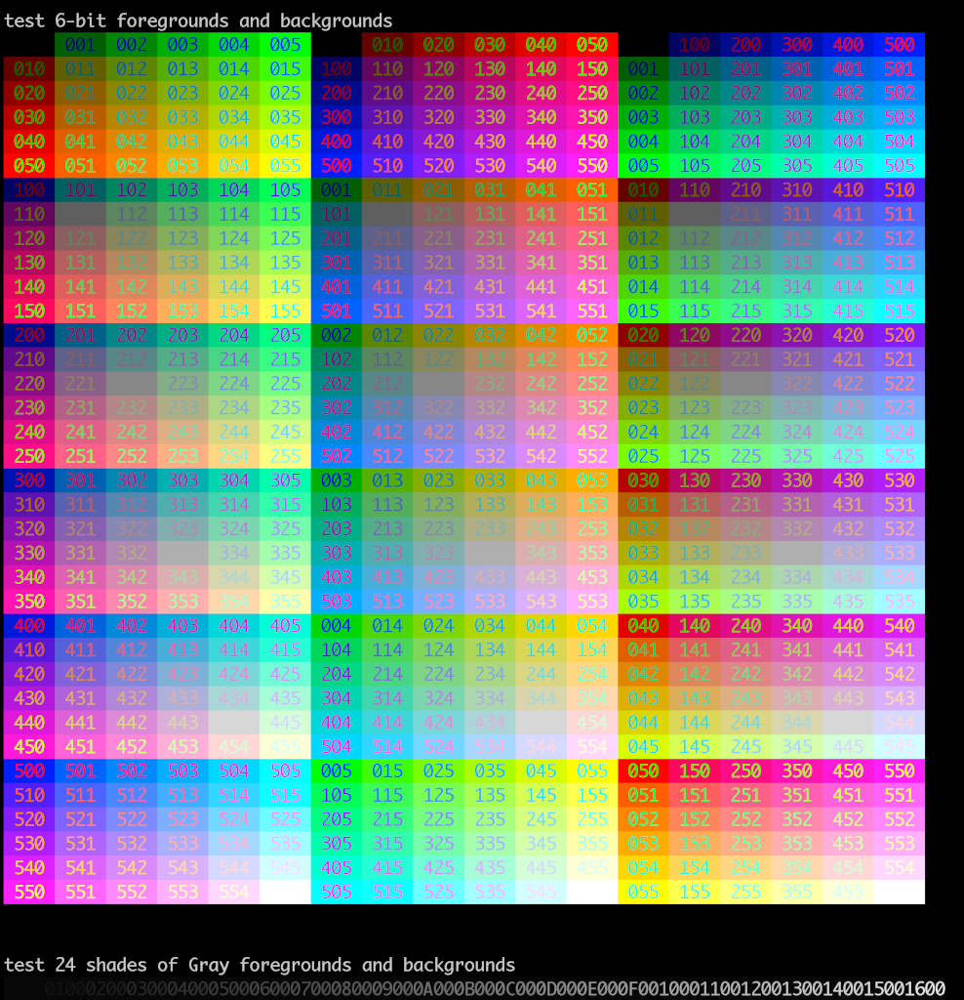

fANSI Library

This library allows you to send ANSI control sequences to a PC, Mac, or Linux
machine simply by sending to the Arduino Serial port.

You can view the output in any terminal or console window on any operating system
that supports ANSI escape sequences.

Includes support for 4-bit, 6-bit, and full 24-bit color support in common
terminal window output from any microcontroller that can output serial data
at 9600 N81. Which is pretty much every one.

Includes support for cursor on/off, cursor positioning, erasing to end-of-display
or to end-of-line, alternate screen buffers, borders, and more!

To display the output from the Arduino or other MCU just copy from the COM port or device to your console output:

```
ripred$ ls /dev/cu.usb*
/dev/cu.usbserial-0001
ripred$
ripred$
ripred$ cat /dev/cu.usbserial-0001 
```

